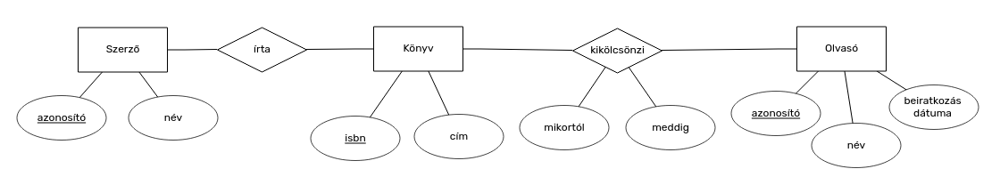
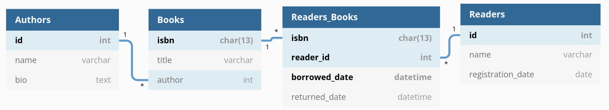

# Beadandó feladat

## Kiírás

1. NodeJS (Express/React) / PHP / más szerver oldali nyelven megírt REST API
    - REST kérések kezelése
        - GET / POST / PUT / DELETE
        - erőforrás
    - jogosultság kezelés
2. Adattároló réteg
    - Relációs DB vagy Mongo
        - legalább 3 tábla/gyűjtemény, ami kapcsolódik
3. Legalább 2 jogosultsági szint

Határidő: dec 8. (névsor első fele + prezentálni kell)

(users táblát hanyagoljuk!)

## Dokumentáció

Könyvtári adatbázis jelentősen leegszerűsítve (nem kezel példányszámot, eltérő kiadásokat, stb.).

### Adatbázis terv

#### ER modell

#### Relációs modell

### API dokumentáció

| Erőforrás | Method   | URL             | Eljárás                 |
|-----------|----------|-----------------|-------------------------|
| Book      | `GET`    | `/books`        | Összes lekérdezése      |
| Book      | `GET`    | `/books/{id}`   | Lekérdezés `id` alapján |
| Book      | `POST`   | `/books`        | Új hozzáadása           |
| Book      | `PUT`    | `/books/{id}`   | Módosítás `id` alapján  |
| Book      | `DELETE` | `/books/{id}`   | Összes lekérdezése      | Törlés `id` alapján |
| Author    | `GET`    | `/authors/{id}` | Lekérdezés `id` alapján |
| Author    | `POST`   | `/authors`      | Új hozzáadása           |
| Author    | `PUT`    | `/authors/{id}` | Módosítás `id` alapján  |
| Author    | `DELETE` | `/authors/{id}` | Törlés `id` alapján     |
| Reader    | `GET`    | `/readers`      | Összes lekérdezése      |
| Reader    | `GET`    | `/readers/{id}` | Lekérdezés `id` alapján |
| Reader    | `POST`   | `/readers`      | Új hozzáadása           |
| Reader    | `PUT`    | `/readers/{id}` | Módosítás `id` alapján  |
| Reader    | `DELETE` | `/readers/{id}` | Törlés `id` alapján     |
